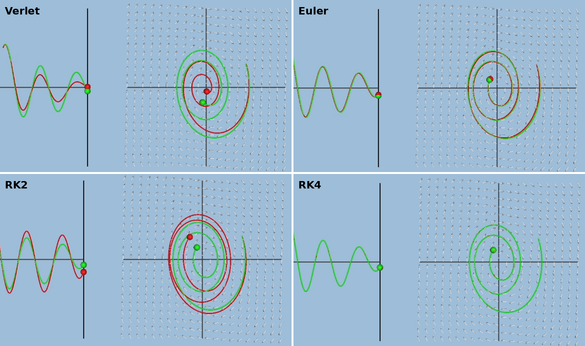
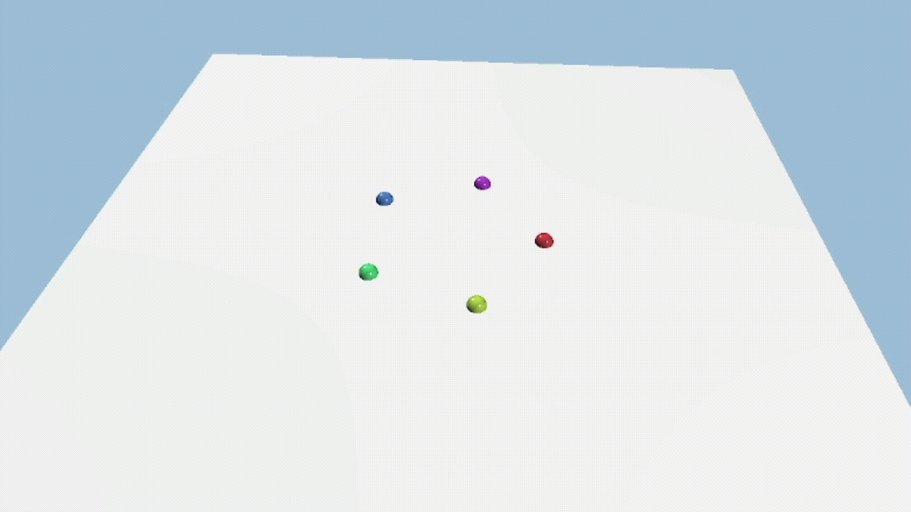
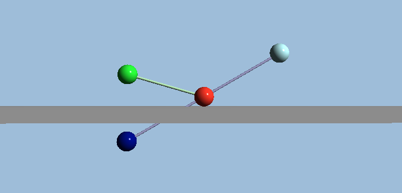
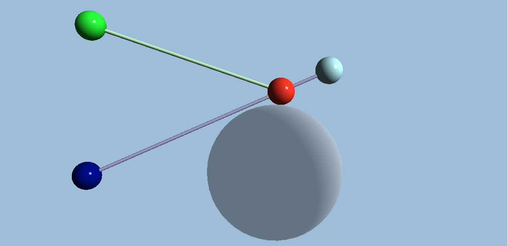
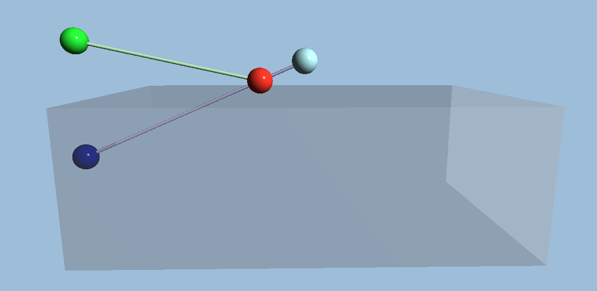
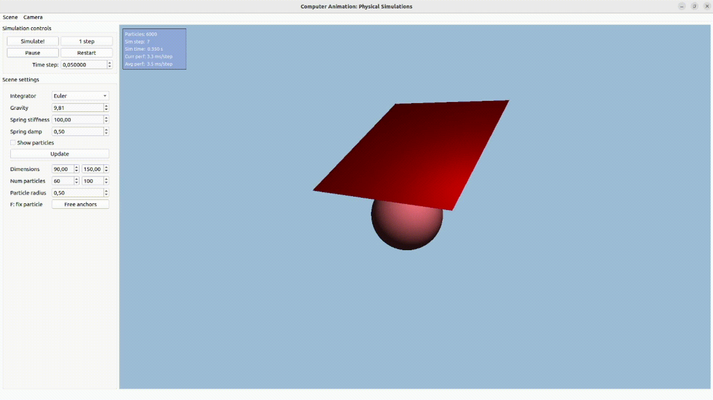
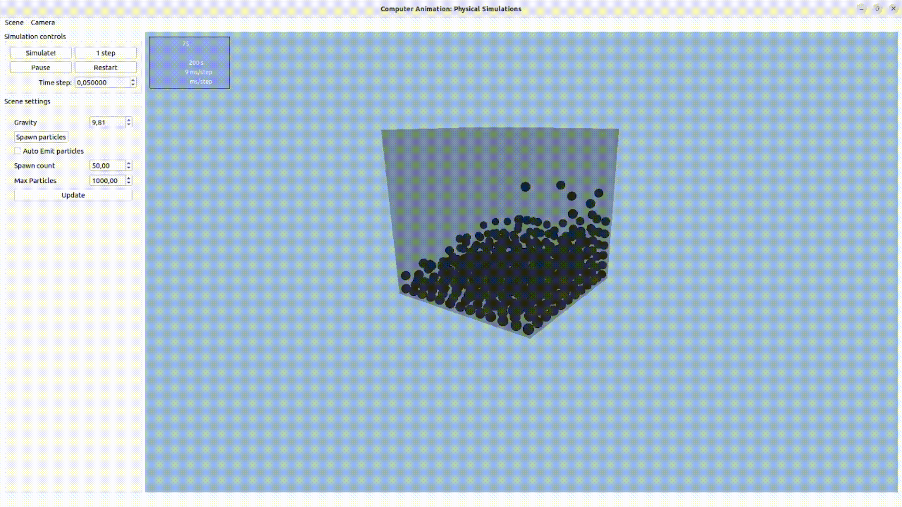

# CA-Simulation

A C++/Qt/OpenGL sandbox implementing classic computer animation techniques: numerical integrators, particle-system forces, collisions, Provot's cloth simulation, and Smoothed Particle Hydrodynamics (SPH) for fluids.

## Numerical Solvers

Several numerical integration methods (e.g. Euler, Symplectic Euler, Midpoint, Verlet, RK2/RK4) were implemented and compared for stability and accuracy when integrating particle motion over time.

## Particle System Forces

A particle system supporting multiple force generators like gravity, drag and springs.

## Collisions

Collision detection and response against different collider primitives (planes, spheres, AABB), including bouncing.

## Provot's Cloth Simulation

A mass-spring cloth simulation using Provot's dynamic inverse procedure to enforce inextensibility constraints and prevent excessive stretching.

## Smoothed Particle Hydrodynamics (SPH)

A particle-based fluid simulation using SPH to approximate pressure, viscosity, and density fields for realistic fluid behavior.

## Note

The following project was completed within a limited timeframe for a master's-level course. The core of the program is written in QT and is a bit outdated, so in the future I'd like to completely rewrite it using DearImGUI, since I'm now much more familiar with it.

